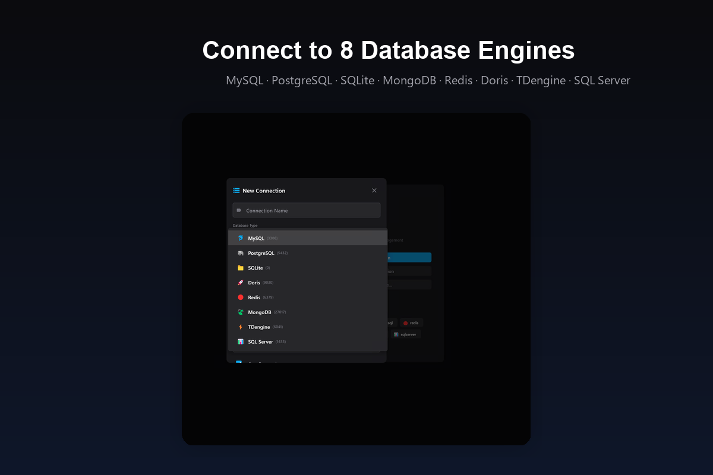
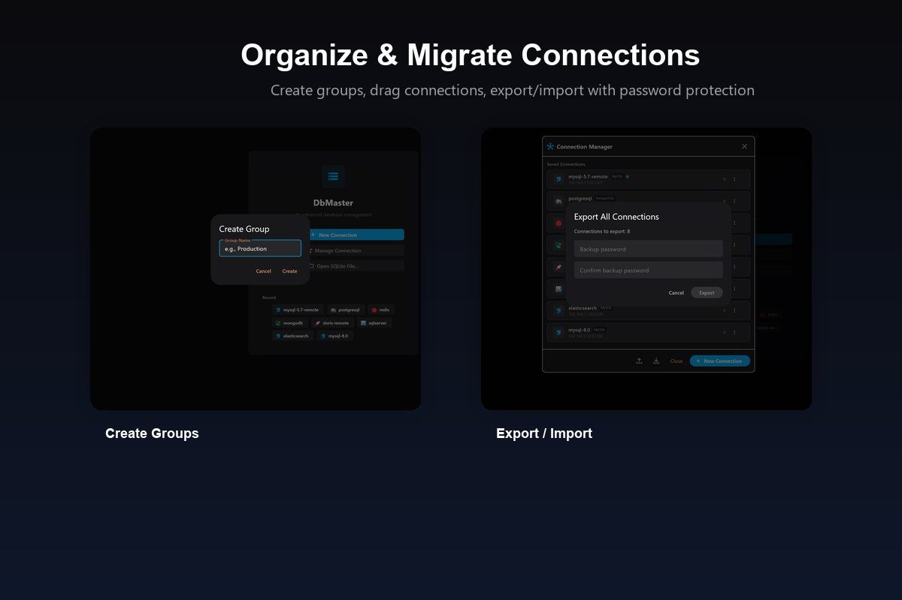
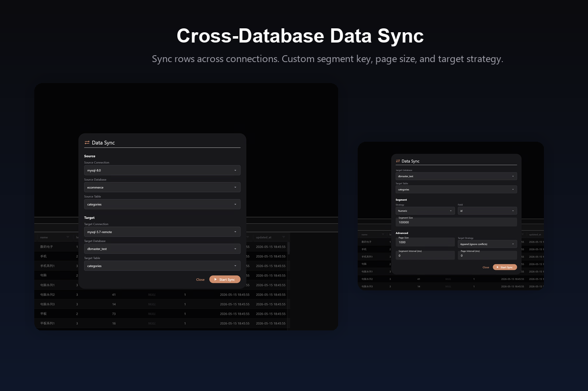
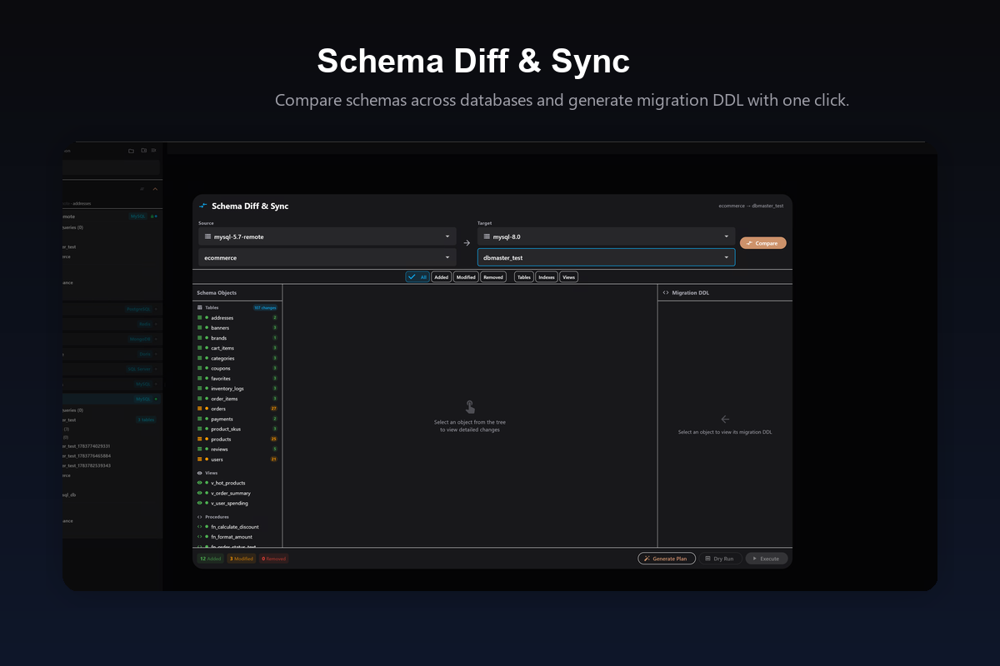
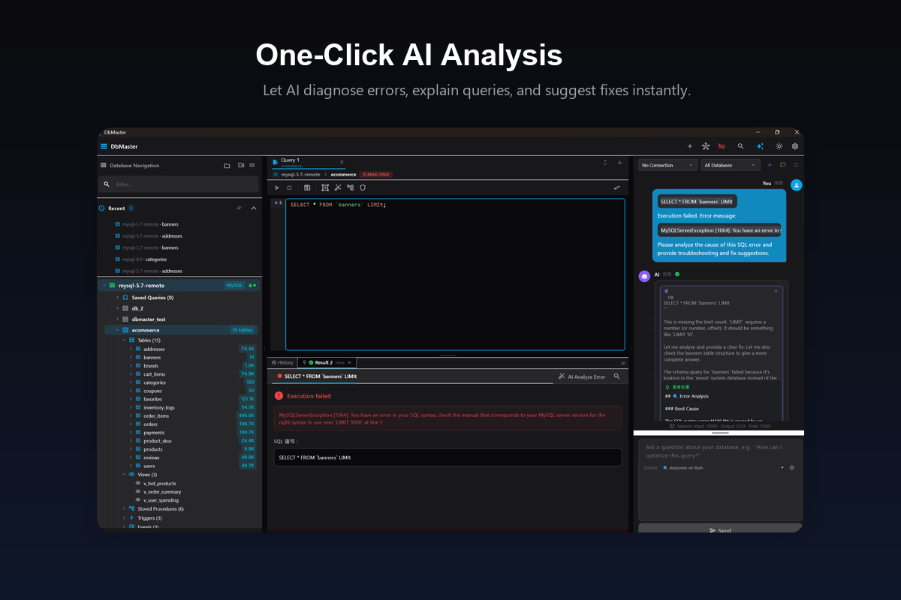
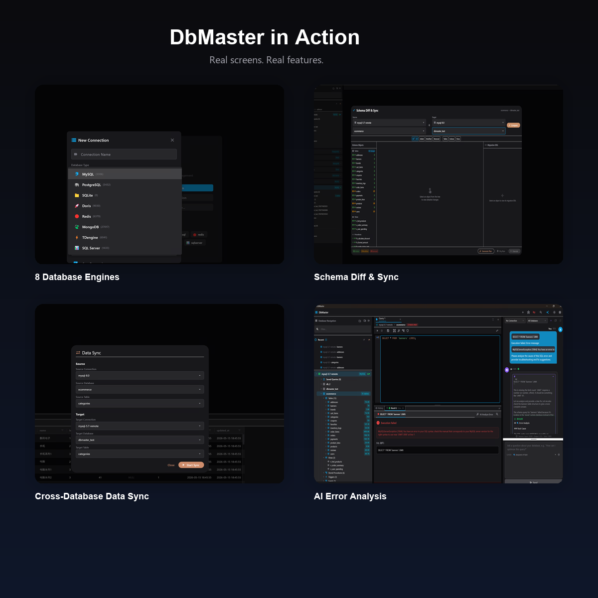
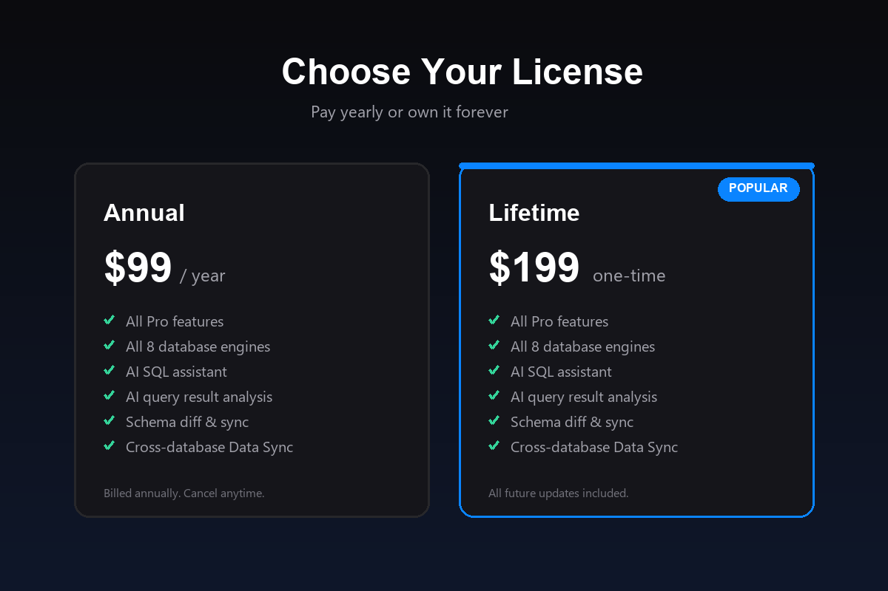

# DbMaster — Gumroad 上架素材包

本目录包含 DbMaster 在 Gumroad 上架所需的全部营销素材：商品描述、图片、视频及脚本。

---

## 📦 交付物清单

| 文件 | 说明 | 用途 |
|-----|------|------|
| `product-description.md` | 中英文商品描述 + 字段速查 + 推广文案 | 复制到 Gumroad Description |
| `cover-1280x720.png` | 商品封面图（1280×720，真实 8 数据库类型截图） | Gumroad Cover Image |
| `thumbnail-600x600.png` / `thumbnail-600x600.jpg` | 商品缩略图（600×600 方形，PNG/JPG 双格式） | Gumroad Thumbnail / 社交分享 |
| `pricing-1200x800.png` | 定价对比图（1200×800） | 描述内插入 / 社交媒体 |
| `features-1200x1050.png` | 功能亮点图（1200×1050，含 Data Sync / Schema Diff / AI） | 描述内插入 / 社交媒体 |
| `ai-features-1200x650.png` | AI 专项功能图（1200×650） | 描述内插入 / 社交媒体 |
| `db-types-1200x800.png` | 8 数据库类型展示图（真实截图） | 描述内插入 / 社交媒体 |
| `connection-management-1200x800.png` | 连接分组 + 导入导出展示图（真实截图） | 描述内插入 / 社交媒体 |
| `data-sync-1200x800.png` | Data Sync 展示图（真实截图） | 描述内插入 / 社交媒体 |
| `schema-diff-1200x800.png` | Schema Diff & Sync 展示图（真实截图） | 描述内插入 / 社交媒体 |
| `ai-analysis-1200x800.png` | AI 一键分析展示图（真实截图） | 描述内插入 / 社交媒体 |
| `feature-gallery-1200x1200.png` | 4 宫格真实截图拼图 | 社交分享 / 快速预览 |
| `promo-video-1920x1080.mp4` | 30 秒推广视频（基于真实截图，无音频） | Gumroad 产品视频 |
| `video-script.md` | 视频分镜脚本 + 配音建议 + 使用建议 | 参考文档 |
| `generate_assets.py` | 图形化图片生成脚本（Python + PIL） | 如需修改可重新生成 |
| `generate_screenshot_assets.py` | 真实截图营销图生成脚本（Python + PIL） | 替换截图后重新生成 |
| `generate_video.py` | 视频生成脚本（Python + OpenCV） | 如需修改可重新生成 |
| `preview-frame-*.jpg` | 视频关键帧预览 | 快速查看视频内容 |

---

## 🚀 Gumroad 上架步骤

### 1. 注册/登录 Gumroad
- 访问 https://gumroad.com/
- 完成邮箱验证、PayPal/Payoneer/银行账户绑定

### 2. 创建产品
- 点击右上角 **Start Selling** → **New product**
- 选择 **Digital product**

### 3. 填写基本信息

| 字段 | 填写内容 |
|-----|---------|
| Name | DbMaster — AI-Powered Database Manager |
| Subtitle | One desktop app for MySQL, PostgreSQL, MongoDB, Redis & more |
| Category | Software / Developer Tools |
| Cover Image | 上传 `cover-1280x720.png` |
| Thumbnail | 上传 `thumbnail-600x600.png` 或 `thumbnail-600x600.jpg` |

### 4. 设置价格（两个版本）

Gumroad 中创建两个 **Variants**：

1. **Annual**
   - Price: `$99 USD`
   - Type: **Subscription** → Recurring → **Yearly**
   - Description: `Full Pro access. Includes all current features, continuous updates, and priority email support. Billed annually. Cancel anytime.`

2. **Lifetime**
   - Price: `$199 USD`
   - Type: **One-time purchase**
   - Description: `Pay once, own DbMaster forever. Includes all current and future Pro features, lifetime updates, and priority email support. No recurring fees.`

> 注意：Gumroad 的 Variant 功能需要开通 Gumroad Premium（$10/月）或按交易付费。若不想用 Variant，也可以拆成两个独立产品链接。

### 5. 填写描述
- 打开 `product-description.md`
- 复制「英文主描述」部分到 Gumroad 的 Description 编辑器
- 在描述中插入图片（优先使用真实截图）：
  ```markdown
  
  
  
  
  
  
  
  ```
- Gumroad 支持 Markdown，可直接粘贴

### 6. 上传文件
- 在 **Content** 区域上传对应平台的安装包：
  - macOS: `.dmg`
  - Windows: `.exe` 或 `.zip`
  - Linux: `.tar.gz` 或 `.AppImage`
- 可同时上传多个文件，Gumroad 会根据购买自动提供下载

### 7. 上传视频
- 在 **Cover** 或 **Gallery** 区域上传 `promo-video-1920x1080.mp4`
- 视频会显示在商品页顶部，显著提升转化率

### 8. 设置其他字段

| 字段 | 建议 |
|-----|------|
| Tags | `database`, `sql`, `mysql`, `postgresql`, `mongodb`, `redis`, `ai`, `developer tools`, `dba` |
| Custom domain | 可选，绑定自己的域名更显专业 |
| License keys | 如需序列号，可开启 Gumroad 自动生成 |
| Refund policy | 建议填写 `14-day money-back guarantee` |
| Support email | `support@dbmaster.app` |

### 9. 发布
- 点击 **Publish**
- 复制产品链接：`https://gumroad.com/l/YOUR_PRODUCT_ID`
- 用于社交媒体、邮件、官网引流

---

## 🎨 修改/重新生成素材

如需调整文案、颜色或尺寸，可重新运行脚本：

```bash
cd assets/gumroad

# 重新生成图形化图片
python3 generate_assets.py

# 重新生成基于真实截图的营销图片（screens/ 目录更新后执行）
python3 generate_screenshot_assets.py

# 重新生成视频
python3 generate_video.py
```

依赖：
- Python 3
- Pillow (`pip install pillow`)
- OpenCV-Python (`pip install opencv-python`)

---

## ⚠️ 注意事项

1. **我无法替你完成 Gumroad 实际注册和收款绑定**，需要你自己登录并填写税务/银行信息。
2. 视频为无音频版本，建议添加背景音乐和/或配音后使用。
3. `promo-video-1920x1080.mp4` 约 19MB，如不希望放入 Git，请在项目根目录 `.gitignore` 中添加：
   ```
   assets/gumroad/promo-video-1920x1080.mp4
   assets/gumroad/preview-frame-*.jpg
   ```
4. 产品版本定价策略（$99 年付 / $199 买断）与 App Store 内购定价不同，请注意区分渠道，避免用户困惑。

---

## 📎 相关链接

- 项目截图：`screenshots/`
- App Store 上架指南：`APPSTORE_SUBMISSION_GUIDE.md`
- 项目说明：`README.md`
