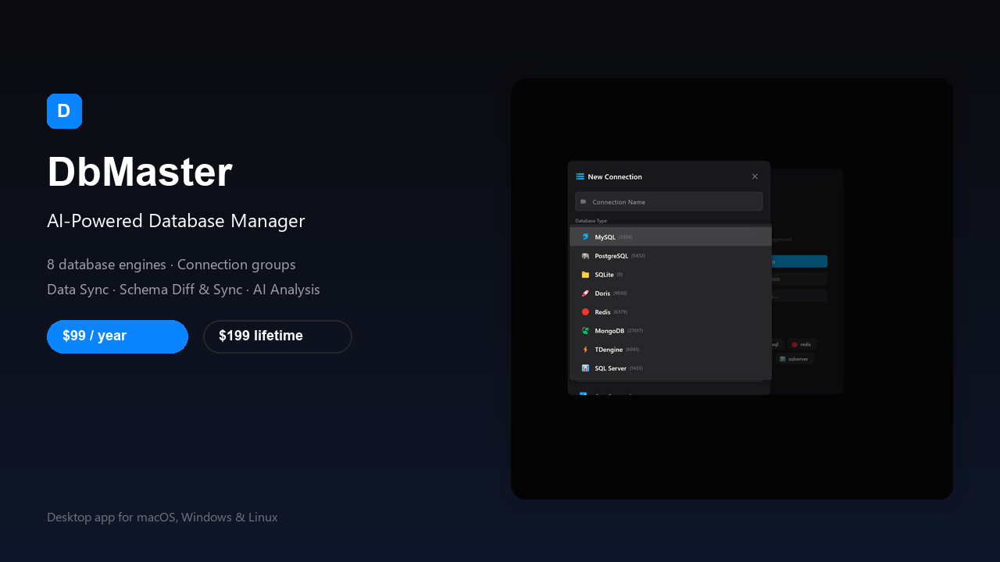

# DbMaster — Gumroad 商品描述

> 本文件为 Gumroad 上架准备。包含英文主描述（Gumroad 默认语言）和中文参考版本。
> 两个版本：Annual $99 / 年，Lifetime $199 / 买断。
>
> 图片使用说明见本文档末尾「[图片插入指南](#图片插入指南)」。

---

## 英文主描述（English — Primary）

```text
DbMaster — AI-Powered Database Manager for Professionals

Manage MySQL, PostgreSQL, SQLite, MongoDB, Redis, Doris, TDengine, and SQL Server from one beautiful desktop app. DbMaster combines a modern SQL editor, intelligent schema tools, and native AI assistance to help you write, analyze, and optimize database work faster.

<!-- INSERT IMAGE: cover-1280x720.png (optional, appears as hero image if not used as Cover) -->


✅ Supported databases
MySQL · PostgreSQL · SQLite · MongoDB · Redis · Doris · TDengine · SQL Server

<!-- INSERT IMAGE: db-types-1200x800.png — shows all 8 database engines in the connection dialog -->


✅ What you get
• AI SQL Assistant — ask in natural language, get executable SQL, explanations, and optimization tips
• AI Query & Error Analysis — click "AI Analyze" on any result or error tab for performance, index, and fix diagnostics
• Smart Query Editor — syntax highlighting, autocomplete, formatting, and EXPLAIN visualization
• Visual Schema Tools — ER diagrams and DDL impact analysis with rollback scripts
• Schema Diff & Sync — compare two database schemas and generate migration DDL to sync them
• Data Sync — sync rows across different connections/databases with truncate, append, replace, or upsert strategies, plus custom segment key support
• Data Import & Export — 5-step import wizard, SQL INSERT export, CSV output
• Query History & Audit — full-text search, filtering, and local audit log
• Connection Management — groups, folders, drag-and-drop, read-only mode, export/import with password protection
• Multi-Language UI — English, 简体中文, 繁體中文, Deutsch, Français, Русский
• Dark & Light themes

<!-- INSERT IMAGE: ai-analysis-1200x800.png — one-click AI diagnosis of query errors -->


<!-- INSERT IMAGE: schema-diff-1200x800.png — compare schemas and generate migration DDL -->


<!-- INSERT IMAGE: data-sync-1200x800.png — cross-database data sync workflow -->


✅ Choose your license
• Annual — $99/year  
  Full Pro access, all updates, priority support. Best for teams and professionals who want continuous improvements.
• Lifetime — $199 one-time  
  Pay once, own forever. All current and future Pro features, all updates, no recurring fees.

<!-- INSERT IMAGE: pricing-1200x800.png — Annual vs Lifetime license comparison -->


✅ System requirements
• macOS 10.15+ (primary)
• Windows 10/11
• Linux

✅ Why DbMaster?
Built for developers, DBAs, and data analysts who switch between multiple database engines daily. No browser tabs, no juggling multiple tools — just one fast, keyboard-friendly app with AI built in.

✅ AI at every step
DbMaster doesn't just connect to your databases — it understands them. Ask the AI assistant to write or explain SQL, analyze a slow query's execution plan, or diagnose errors. After running any query, click "AI Analyze" on the result tab to get instant performance insights, index recommendations, and fix suggestions. It's like having a senior DBA paired with your editor.

✅ Organize & migrate connections
Create connection groups (Production, Test, etc.), drag connections between groups, and export or import your entire connection list with password-protected backup files. Perfect for teams and developers who work across multiple environments.

<!-- INSERT IMAGE: connection-management-1200x800.png — connection groups and export/import -->


✅ License terms
Per-user license. You may use the license on the machines you personally use for development. Source code is not included.

✅ Support & refund
• Email support: support@dbmaster.app
• 14-day money-back guarantee. If DbMaster doesn't fit your workflow, contact us for a full refund.

<!-- INSERT IMAGE: feature-gallery-1200x1200.png — 4-panel real screenshot gallery (optional, at the end) -->


Download your copy and start managing databases the smart way.
```

---

## 中文参考描述

```text
DbMaster — 专业级 AI 数据库管理客户端

一款桌面端多数据库管理工具，支持 MySQL、PostgreSQL、SQLite、MongoDB、Redis、Doris、TDengine、SQL Server。DbMaster 将现代 SQL 编辑器、智能 Schema 工具和原生 AI 助手整合在一处，让你更快地完成数据库编写、分析与优化。

<!-- INSERT IMAGE: cover-1280x720.png（可选，若未用作封面图可放在此处作为头图） -->


✅ 支持的数据库
MySQL · PostgreSQL · SQLite · MongoDB · Redis · Doris · TDengine · SQL Server

<!-- INSERT IMAGE: db-types-1200x800.png — 展示连接对话框中的 8 种数据库 -->


✅ 核心功能
• AI SQL 助手：用自然语言提问，生成可执行 SQL、解释与优化建议
• AI 查询与错误分析：任意结果页或报错页点击「AI 分析」，获取性能、索引与修复诊断
• 智能查询编辑器：语法高亮、自动补全、格式化、EXPLAIN 可视化
• 可视化 Schema 工具：ER 图、DDL 影响分析与回滚脚本
• Schema Diff & Sync：对比两个数据库结构并生成迁移 DDL 同步
• Data Sync：跨连接/跨库同步表数据，支持清空、追加、替换、Upsert 策略，支持自定义分段键
• 数据导入导出：5 步导入向导、SQL INSERT 导出、CSV 输出
• 查询历史与审计：全文检索、筛选、本地审计日志
• 连接管理：分组、文件夹、拖拽、只读模式，支持带密码保护的连接导入导出
• 多语言界面：英文、简体中文、繁体中文、德文、法文、俄文
• 深色 / 浅色主题

<!-- INSERT IMAGE: ai-analysis-1200x800.png — 一键 AI 诊断 SQL 报错 -->


<!-- INSERT IMAGE: schema-diff-1200x800.png — 对比结构并生成迁移 DDL -->


<!-- INSERT IMAGE: data-sync-1200x800.png — 跨库数据同步流程 -->


✅ 选择你的授权
• 包年版 — $99/年  
  完整 Pro 功能、全部更新、优先支持。适合需要持续获得改进的团队与专业人士。
• 买断版 — $199 一次性  
  一次付费，永久拥有。包含当前与未来所有 Pro 功能与更新，无订阅费用。

<!-- INSERT IMAGE: pricing-1200x800.png — 包年 vs 买断授权对比 -->


✅ 系统要求
• macOS 10.15+（主要开发平台）
• Windows 10/11
• Linux

✅ 为什么选 DbMaster？
为每天需要在多种数据库引擎之间切换的开发者、DBA 和数据分析师打造。无需浏览器标签页，无需在多个工具间来回切换 —— 一个快速、键盘友好、内置 AI 的桌面应用即可搞定。

✅ AI 贯穿工作流
DbMaster 不只是连接数据库，更能理解数据库。让 AI 助手帮你写 SQL、解释复杂查询、分析执行计划或诊断报错；执行任意查询后，在结果页或报错页点击「AI 分析」，即可立即获得性能洞察、索引建议与修复方案。就像有一位资深 DBA 常驻在你的编辑器里。

✅ 连接组织与迁移
创建连接分组（如 Production、Test 等），在分组之间拖拽连接，还能导出/导入整个连接列表并设置备份密码。适合在多个环境之间切换的团队和开发者。

<!-- INSERT IMAGE: connection-management-1200x800.png — 连接分组与导入导出 -->


✅ 授权说明
按用户授权。你可在个人开发使用的机器上安装使用。不含源代码。

✅ 支持与退款
• 邮件支持：support@dbmaster.app
• 14 天无理由退款。如 DbMaster 不符合你的工作流，可联系我们全额退款。

<!-- INSERT IMAGE: feature-gallery-1200x1200.png — 四宫格真实截图拼图（可选，放在末尾） -->


立即下载，开启更智能的数据库管理体验。
```

---

## 图片插入指南

Gumroad 的 Description 编辑器支持 Markdown，可直接粘贴上方带 `` 的文本。上传图片时，把对应文件拖到 Gumroad 编辑器中，Markdown 中的相对路径会自动替换为 Gumroad 的 CDN 链接。

### 推荐图片与插入位置速查

| 推荐插入位置 | 推荐图片 | 图片说明 |
|---|---|---|
| 标题/开场后 | `cover-1280x720.png` | 产品主视觉，含 8 数据库类型截图 |
| 数据库列表后 | `db-types-1200x800.png` | 8 种数据库引擎选择界面 |
| AI 功能段落后 | `ai-analysis-1200x800.png` | 一键 AI 分析查询错误 |
| Schema Diff 段落后 | `schema-diff-1200x800.png` | Schema 对比与迁移 DDL |
| Data Sync 段落后 | `data-sync-1200x800.png` | 跨库数据同步配置 |
| 授权/定价段落后 | `pricing-1200x800.png` | Annual vs Lifetime 价格对比 |
| 连接管理段落后 | `connection-management-1200x800.png` | 连接分组与导入导出 |
| 描述末尾 | `feature-gallery-1200x1200.png` | 四宫格功能截图汇总 |

### 最小推荐插入组合（保留 4 张核心图）

如果担心描述过长，至少保留以下 4 张图：

1. `db-types-1200x800.png` — 第一眼告诉用户支持哪些数据库
2. `ai-analysis-1200x800.png` — 突出 AI 差异化卖点
3. `schema-diff-1200x800.png` 或 `data-sync-1200x800.png` — 展示高级功能
4. `pricing-1200x800.png` — 强化价格锚点

### 注意事项

- `cover-1280x720.png` 通常作为 Gumroad Cover Image 上传，不一定需要再次插入描述中；如果 Gumroad 允许描述内大图，也可以放在最上方作为头图。
- `thumbnail-600x600.png` 用于 Gumroad Library / Discover / Profile 页的缩略图，**不要插入到描述正文中**。
- 所有图片已基于真实产品截图生成，可直接上传。

---

## Gumroad 字段速查

| Gumroad 字段 | 建议填写内容 |
|-------------|------------|
| Product Name | DbMaster — AI-Powered Database Manager |
| Subtitle | One desktop app for MySQL, PostgreSQL, MongoDB, Redis & more |
| Price | 创建两个 Variant：Annual $99 USD，Lifetime $199 USD |
| Category | Software / Developer Tools |
| Tags | database, sql, mysql, postgresql, mongodb, redis, ai, developer tools, dba, data analysis |
| Cover Image | `assets/gumroad/cover-1280x720.png`（真实 8 数据库类型截图） |
| Thumbnail | `assets/gumroad/thumbnail-600x600.png` |
| Description | 粘贴上方英文主描述 |
| Files | 上传对应平台的安装包（.dmg / .exe / .zip） |
| License Keys | 可选：Gumroad 可自动生成序列号 |
| Refund Policy | 14-day money-back guarantee |
| Support Email | support@dbmaster.app |

---

## 版本差异说明（用于 Gumroad Variant 描述）

### Annual — $99/year
```text
Full Pro access to DbMaster. Includes all current features, continuous updates, and priority email support. Billed annually. Cancel anytime.
```

### Lifetime — $199 one-time
```text
Pay once, own DbMaster forever. Includes all current and future Pro features, lifetime updates, and priority email support. No recurring fees.
```

---

## 推广文案变体（可选，用于社交媒体/邮件）

### 短文案 A（强调 AI）
```text
Tired of switching between database tools?

DbMaster puts MySQL, PostgreSQL, MongoDB, Redis, and 4 more engines into one AI-powered desktop app.

Ask AI to write SQL, analyze results, diff schemas, and sync data across databases.

Annual: $99/year
Lifetime: $199 one-time

→ gumroad.com/l/YOUR_LINK
```

### 短文案 B（强调买断）
```text
One database tool. Eight engines. No subscription trap.

DbMaster Lifetime is $199 once — every Pro feature, every update, forever.

→ gumroad.com/l/YOUR_LINK
```

### 中文推广文案
```text
还在多个数据库客户端之间来回切换？

DbMaster 把 MySQL、PostgreSQL、MongoDB、Redis 等 8 种数据库整合到一个 AI 驱动的桌面应用中。

AI 写 SQL、分析查询结果、Schema Diff 对比、跨库 Data Sync —— 一应俱全。

包年 $99/年 ｜ 买断 $199 永久

→ gumroad.com/l/YOUR_LINK
```
